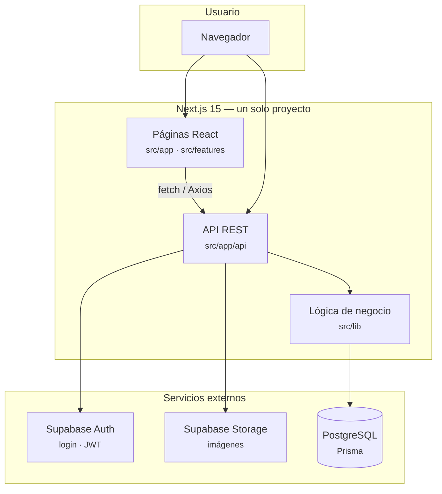

# Arquitectura

## Visión general

El CRM de venta interna y externa es una **aplicación monolítica full-stack** en Next.js: la interfaz React y la API REST viven en el mismo despliegue (`src/app`).

### Diagrama de flujo



**Lectura del diagrama:** el usuario entra por el navegador; las pantallas llaman a la API interna; la API usa reglas en `src/lib` y se conecta a Supabase y PostgreSQL.

## Capas

| Capa | Ubicación | Responsabilidad |
|------|-----------|-----------------|
| **Presentación** | `src/app/**/page.tsx`, `src/features/**` | UI por rol, formularios, tablas |
| **API** | `src/app/api/**/route.ts` | Contrato HTTP, auth, validación Zod |
| **Dominio** | `src/lib/*.ts` | Reglas de negocio (reservas, reportes, cupos) |
| **Datos** | Prisma + `src/generated/prisma` | Acceso a PostgreSQL |
| **Auth** | Supabase + `auth-middleware.ts` | JWT, roles `admin` / `agent` / `customer` |

## Roles y superficies

| Rol | Superficie principal |
|-----|----------------------|
| `admin` | CRM completo|
| `agent` | Reservas, consulta catálogo/proveedores; sin crear tours/transfers/usuarios ni reportes |
| `customer` | Catálogo público; reservas propias vía API según permisos |

El control de rutas en cliente está en `src/lib/route-access.ts` y `AuthRouteGuard`.

## Respuesta API estándar

```json
{
  "success": true,
  "data": {},
  "message": "opcional",
  "pagination": { "page": 1, "limit": 10, "total": 100 }
}
```

Errores habituales: **400** validación · **401** token · **403** rol · **404** · **409** conflicto · **503** BD no disponible (prisma.ts) o CRON_SECRET no configurado.

