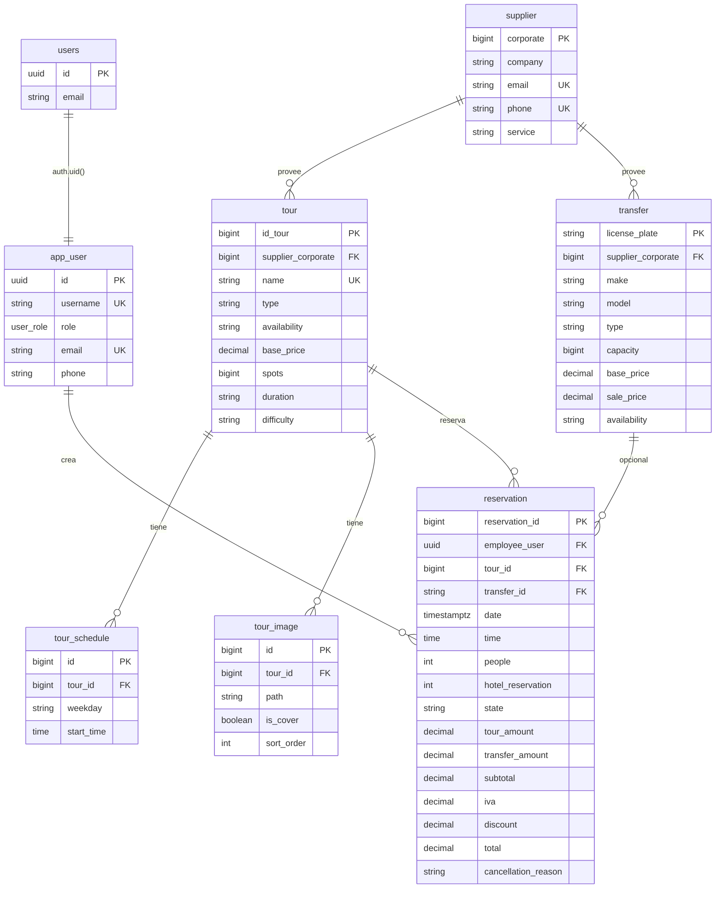

# Base de datos

## Prisma

- **Schema:** `prisma/schema.prisma`
- **Provider:** PostgreSQL
- **Schemas:** `public` (negocio), `auth` (tablas Supabase)

El cliente se genera con `output = "../src/generated/prisma"`.

## Modelos de negocio (`public`)

| Modelo | Clave | Relaciones principales |
|--------|-------|------------------------|
| `app_user` | `id` (UUID, FK a `auth.users`) | `reservation[]` |
| `supplier` | `corporate` (BigInt) | `tour[]`, `transfer[]` |
| `tour` | `id_tour` | `supplier`, `tour_image`, `tour_schedule`, `reservation` |
| `tour_image` | `id` | `tour` |
| `tour_schedule` | `id` | `tour` — `weekday`, `start_time` |
| `transfer` | `license_plate` | `supplier`, `reservation` |
| `reservation` | `reservation_id` | `tour`, `transfer?`, `app_user` |

## Enum de roles

```prisma
enum user_role {
  admin
  agent
  customer
}
```

## Proveedor interno

Tours/transfers sin proveedor externo usan `INTERNAL_SUPPLIER_CORPORATE = 999999000000001` (`src/lib/internal-supplier.ts`), creado con `ensureInternalSupplierExists`.

## Reservas — campos relevantes

| Campo | Notas |
|-------|-------|
| `state` | En BD: cancelada vs no cancelada; estados `pending`/`in_progress`/`completed` se calculan o sincronizan vía cron |
| `date`, `time` | Fecha/hora del turno |
| `people` | Pasajeros |
| `tour_amount`, `transfer_amount`, `subtotal`, `iva`, `discount`, `total` | Montos calculados en API |
| `cancellation_reason` | Obligatorio al cancelar |

## Diagrama entidad-relación

**Modelo lógico** del CRM: relaciones del esquema `public` y vínculo con `auth.users` (Supabase). En cada entidad: **PK** = clave primaria, **FK** = clave foránea, **UK** = único.


