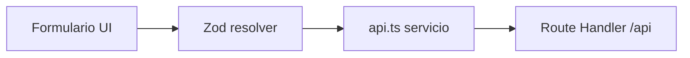

# Módulos de la app

Cada dominio del CRM vive en `src/features/<modulo>/` y usa **React Hook Form + Zod** para validar lo que el usuario envía antes de llamar a `src/lib/api.ts` (Axios).

## Resumen

| Módulo | Rutas | Rol | Schema / validación | Servicio API |
|--------|-------|-----|---------------------|--------------|
| [Autenticación](autenticacion.md) | `/login`, `/auth/*` | Todos (público/recuperación) | `user.schema.ts` | `authService` |
| [Usuarios](usuarios.md) | `/usuarios/*` | **admin** | `user.schema.ts` | `userService` |
| [Tours](tours.md) | `/tours/*` | admin, agent (crear solo admin) | `tour.schema.ts` + formularios en feature | `tourService` |
| [Transfers](transfers.md) | `/transfers/*` | admin, agent (crear solo admin) | `transfer.schema.ts` | `transferService` |
| [Proveedores](proveedores.md) | `/proveedores/*` | admin, agent (crear solo admin) | `supplier.schema.ts` | `supplierService` |
| [Reservas](reservas.md) | `/reservas/*` | admin, agent | `reservation.schema.ts` | `reservationService` |
| [Reportes](reportes.md) | `/reportes` | **admin** | `report.schema.ts` | `GET /api/reports` |
| [Catálogo cliente](catalogo.md) | `/catalogo/*` | Público / customer | Zod en `TourReservationForm` | WhatsApp (sin POST) |

## Flujo común

1. El usuario completa el formulario o filtros.
2. **Zod** valida tipos, rangos y reglas de negocio en cliente.
3. El **servicio** arma el JSON, query params o `FormData` y llama a la API.
4. Los **hooks** (`useTours`, `useReservations`, …) cachean la respuesta con React Query.

## Esquemas compartidos con el backend

Los archivos en `src/app/schemas/` son la referencia canónica; muchas pantallas duplican reglas en schemas locales del feature (p. ej. `tourFormSchema` en `Create.tsx`) con mensajes orientados al formulario.

## Capas de componentes

| Capa | Ruta | Rol |
|------|------|-----|
| **UI base** | `src/components/ui/*` | shadcn/Radix reutilizable (Button, Table, Dialog, Calendar…) |
| **Layout staff** | `src/components/layout/*` | `DashboardLayout`, `AuthRouteGuard`, spinner de acceso |
| **Shell cliente** | `ClientShellLayout`, `ClientI18nProvider` | Catálogo sin sidebar admin |
| **Navegación** | `app-sidebar`, `nav-main`, `nav-user` | Menú lateral según rol |
| **Dominio** | `src/components/tours/*`, `src/features/*/components/*` | Piezas específicas (carrusel, reportes) |
| **Pantallas** | `src/features/*/*.tsx` | Vistas que componen UI + hooks + API |

### UI más usada en el panel

`Button`, `Input`, `Label`, `Table`, `Dialog`, `Alert`, `AlertDialog`, `DropdownMenu`, `PaginationControls`, `Calendar` + `Popover` (fechas en reservas), `Sonner` (toasts globales).

Cada módulo documenta sus **vistas** (`View`, `Create`, …) y los componentes propios o compartidos que monta.

## Home

`/home` solo enruta según rol (`HomeRouter`); no tiene formulario ni payload propio.
